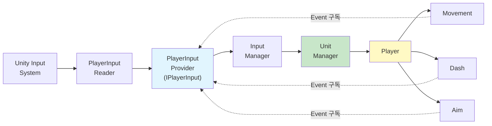

# 2D Topdown Shooter

Unity로 제작한 간단한 2D 탑다운 슈팅 게임 프로젝트입니다.

---

## 📌 프로젝트 개요

- **개발 인원**: 1인 (프로그래머)
- **개발 환경**: Unity 6000.2.7f2
- **주요 라이브러리**: UniTask

---

## 🎮 플레이 방법

- **WASD**: 이동
- **Space**: 대쉬 (스태미나 소모)
- **마우스**: 조준 (자동 사격)

---

## ✨ 세부 구현 시스템

### 1. 플레이어 입력 처리


#### 기능
- WASD를 이용한 이동
- SpaceBar를 이용한 순간적인 대쉬
- 마우스 방향을 따라 자동 조준

<details>
<summary><b>📖 세부 설명 (클릭하여 펼치기)</b></summary>

#### 설계 의도

**목표**
- 입력 계층의 완전한 격리와 변경 영향 최소화

**의도**
- Input 관련 클래스는 오직 Input만 담당
- 다른 로직(이동, 대쉬, 조준 등)은 일절 관여하지 않음
- 입력 처리의 결과만 외부에 노출

#### 구조도


**핵심 구현**

**1. Interface 기반 추상화**
```csharp
public interface IPlayerInput
{
    event Action<Vector2> OnMove;
    event Action OnMoveCanceled;
    event Action<Vector2> OnAim;
    Vector2 CurrentMoveDirection { get; }
    Vector2 CurrentAimPosition { get; }
    event Action<Vector2> OnDashPressed;
}
```
-  Movement/Dash/Aim은 Provider가 어떻게 입력을 처리하는지 알 필요 없이, 입력 변경 사실만 알면 되기에 Interface를 사용하여 구현 세부 은닉

**2. Event-Driven 아키텍처**
```csharp
//PlayerInputProvider.cs
public void UpdateMoveDirection(Vector2 direction) {
    CurrentMoveDirection = direction;
    OnMove?.Invoke(direction);  // Event 발행
}

//Movement.cs
public Movement(IPlayerInput playerInput, ...) {
    playerInput.OnMove += HandleMovePerformed;
}
```
- Provider와 Movement 간 직접 참조를 제거하기 위해 Event 사용

**3. Provider-Reader 분리**
```csharp
//PlayerInputReader.cs
public class PlayerInputReader : MonoBehaviour
{
    ...
    private void OnMovePerformed(InputAction.CallbackContext ctx)
    {
        Vector2 direction = ctx.ReadValue<Vector2>();
        _playerInputProvider.UpdateMoveDirection(direction);
    }
    ...
}

//PlayerInputProvider.cs
public class PlayerInputProvider : IPlayerInput
{
    public event Action<Vector2> OnMove;
    ...

    public void UpdateMoveDirection(Vector2 direction)
    {
        CurrentMoveDirection = direction;
        LastMoveDirection = direction;
        OnMove?.Invoke(CurrentMoveDirection);
    }
    ...
}
```
- Reader : Unity Input System 처리
- Provider : Event 발행만
- Input System 교체 시 Reader만 수정하게 하기 위하여 분리


**클래스 코드 보기**

| 클래스 | 역할 | 코드 |
|--------|------|------|
| **IPlayerInput** | 입력 인터페이스 | [`보기`](Assets/Scripts/Core/Input/Interface/IPlayerInput.cs#L1-L12) |
| **PlayerInputProvider** | IPlayerInput 구현 | [`보기`](Assets/Scripts/Core/Input/Provider/PlayerInputProvider.cs) |
| **PlayerInputReader** | Unity Input 연결 | [`보기`](Assets/Scripts/Core/Input/Reader/PlayerInputReader.cs) |
| **InputManager** | 입력 관리 | [`보기`](Assets/Scripts/Core/GameLoop/InputManager.cs) |
| **UnitManager** | 유닛 관리 | [`보기`](Assets/Scripts/Core/GameLoop/UnitManager.cs) |
| **Player** | 플레이어 | [`보기`](Assets/Scripts/GamePlay/Player/Player.cs) |
| **Movement** | 이동 로직 | [`보기`](Assets/Scripts/GamePlay/Player/Action/Movement.cs) |
| **Dash** | 대쉬 로직 | [`보기`](Assets/Scripts/GamePlay/Player/Action/Dash.cs) |
| **Aim** | 조준 로직 | [`보기`](Assets/Scripts/GamePlay/Player/Action/Aim.cs) |

</details>

---

### 2. Wave 난이도 증가
- UniTask 비동기 타이머
- Wave별 적 스탯/스폰 속도 증가
- 실시간 UI 업데이트

### 3. 오브젝트 풀링
- Generic Pool 패턴 구현
- 총알/적 재사용으로 GC 최소화

### 4. 무기 시스템
- 전략 패턴 (IAttack Interface)
- 3종 무기 (Pistol, Shotgun, MachineGun)
- 런타임 무기 전환

### 5. UI 자동 업데이트
- Property Setter + Dictionary 패턴
- Inspector 기반 UI 등록
- 중앙 집중식 UI 관리

---

## 🏗️ 아키텍처

### Manager 패턴
```
GameManager  (게임 흐름 총괄)
├─ DataManager   (ScriptableObject 관리)
├─ StatManager   (스탯 계산/업그레이드)
├─ UnitManager   (유닛 생성/관리)
├─ PoolManager   (오브젝트 풀링)
├─ InputManager  (입력 처리)
└─ UIManager     (UI 업데이트)
```

### 핵심 설계 패턴

| 패턴 | 적용 위치 | 목적 |
|------|----------|------|
| **Manager** | 전체 구조 | 책임 분리 |
| **Strategy** | 무기 시스템 | 런타임 교체 |
| **Object Pool** | 총알/적 | GC 최적화 |
| **Observer** | UI/이벤트 | 느슨한 결합 |
| **Data-Driven** | ScriptableObject | 밸런싱 용이 |

---

## 현재 기능(완료)
- 탑다운 시점 캐릭터 이동
- 슈팅 시스템
- 풀링
- 기본 적 AI
- 유닛 라이프 사이클(적)
- 적 체력바 표시
- 스폰 시스템
- 공격 판정에 따른 결과 로직
- 공격 스탯 적용
- 유닛 라이프 사이클(플레이어)
- 초기 무기 선택
- 레벨 시스템
- 웨이브 시스템
- UI대응

## 제작 중(진행 중)