# 2D Topdown Shooter

Unity로 제작한 간단한 2D 탑다운 슈팅 게임 프로젝트입니다.

---

## 📌 프로젝트 개요

- **개발 인원**: 1인 (프로그래머)
- **개발 환경**: Unity 6000.2.7f2
- **주요 라이브러리**: UniTask

---

## 🎮 플레이 방법

- **WASD**: 이동
- **Space**: 대쉬 (스태미나 소모)
- **마우스**: 조준 (자동 사격)

---

## 🔄 게임 플로우

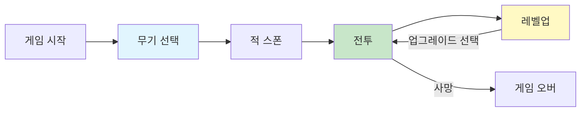
---

## 📁 프로젝트 구조
```
Assets/
├─ Scenes/
│  └─ MainScene.unity
├─ Scripts/
│  ├─ Core/
│  │  ├─ BootStrap/  
│  │  ├─ GameLoop/           # Manager 클래스들
│  │  │  ├─ GameManager.cs
│  │  │  ├─ UnitManager.cs
│  │  │  ├─ StatManager.cs
│  │  │  ├─ PoolManager.cs
│  │  │  ├─ InputManager.cs
│  │  │  └─ UIManager.cs
│  │  └─ Input/              # 입력 시스템
│  │     ├─ Interface/
│  │     ├─ Provider/
│  │     └─ Reader/
│  ├─ GamePlay/
│  │  ├─ Player/             # 플레이어 관련
│  │  ├─ Attack/             # 무기 시스템
│  │  └─ Enemy/              # 적 관련
│  ├─ Data/
│  │  ├─ Enum/
│  │  ├─ LevelData/
│  │  ├─ ScriptableObject_DB/# 데이터 저장소
│  │  ├─ SpawnData/
│  │  ├─ StatData
│  │  ├─ WaveData/
│  │  └─ WeaponData/
│  ├─ UI/                    # UI 관련
│  │  ├─ Interface/
│  │  ├─ Popup/
│  └─ Utils/                 # 유틸리티
└─ Prefabs/

```

---


## ✨ 세부 구현 시스템

### 1. 플레이어 입력 처리

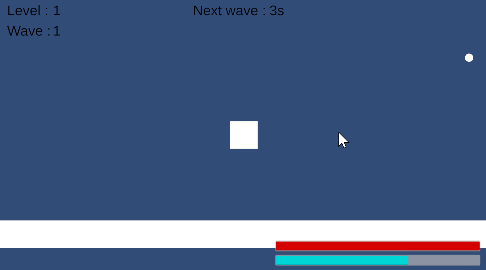

#### 기능
- WASD를 이용한 이동
- SpaceBar를 이용한 순간적인 대쉬
- 마우스 방향을 따라 자동 조준

<details>
<summary><b>📖 세부 설명 (클릭하여 펼치기)</b></summary>

#### 설계 의도

**목표**
- 입력 계층의 완전한 격리와 변경 영향 최소화

**의도**
- Input 관련 클래스는 오직 Input만 담당
- 다른 로직(이동, 대쉬, 조준 등)은 일절 관여하지 않음
- 입력 처리의 결과만 외부에 노출

#### 구조도
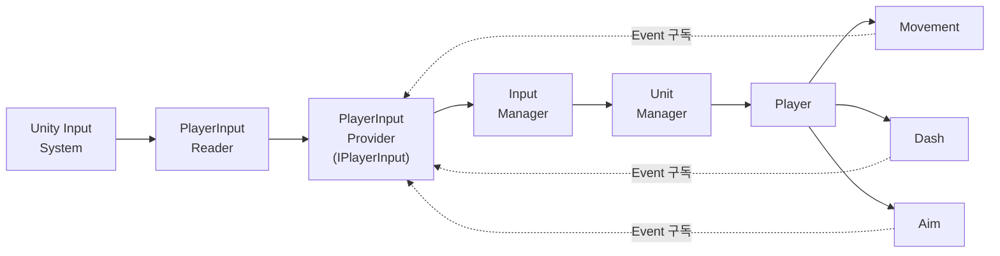

#### 핵심 구현

**1. Interface 기반 추상화**
```csharp
public interface IPlayerInput
{
    event Action<Vector2> OnMove;
    event Action OnMoveCanceled;
    event Action<Vector2> OnAim;
    Vector2 CurrentMoveDirection { get; }
    Vector2 CurrentAimPosition { get; }
    event Action<Vector2> OnDashPressed;
}
```
-  Movement/Dash/Aim은 Provider가 어떻게 입력을 처리하는지 알 필요 없이, 입력 변경 사실만 알면 되기에 Interface를 사용하여 구현 세부 은닉

**2. Event-Driven 아키텍처**
```csharp
//PlayerInputProvider.cs
public void UpdateMoveDirection(Vector2 direction) {
    CurrentMoveDirection = direction;
    OnMove?.Invoke(direction);
}

//Movement.cs
public Movement(IPlayerInput playerInput, ...) {
    playerInput.OnMove += HandleMovePerformed;
}
```
- Provider와 Movement 간 직접 참조를 제거하기 위해 Event 사용

**3. Provider-Reader 분리**
```csharp
//PlayerInputReader.cs
public class PlayerInputReader : MonoBehaviour
{
    ...
    private void OnMovePerformed(InputAction.CallbackContext ctx)
    {
        Vector2 direction = ctx.ReadValue<Vector2>();
        _playerInputProvider.UpdateMoveDirection(direction);
    }
    ...
}

//PlayerInputProvider.cs
public class PlayerInputProvider : IPlayerInput
{
    public event Action<Vector2> OnMove;
    ...

    public void UpdateMoveDirection(Vector2 direction)
    {
        CurrentMoveDirection = direction;
        LastMoveDirection = direction;
        OnMove?.Invoke(CurrentMoveDirection);
    }
    ...
}
```
- Reader : Unity Input System 처리
- Provider : Event 발행만
- Input System 교체 시 Reader만 수정하게 하기 위하여 분리


#### 클래스 코드 보기

| 클래스 | 역할 | 코드 |
|--------|------|------|
| **IPlayerInput** | 입력 인터페이스 | [`보기`](Assets/Scripts/Core/Input/Interface/IPlayerInput.cs#L1-L12) |
| **PlayerInputProvider** | IPlayerInput 구현 | [`보기`](Assets/Scripts/Core/Input/Provider/PlayerInputProvider.cs) |
| **PlayerInputReader** | Unity Input 연결 | [`보기`](Assets/Scripts/Core/Input/Reader/PlayerInputReader.cs) |
| **InputManager** | 입력 관리 | [`보기`](Assets/Scripts/Core/GameLoop/InputManager.cs) |
| **UnitManager** | 유닛 관리 | [`보기`](Assets/Scripts/Core/GameLoop/UnitManager.cs) |
| **Player** | 플레이어 | [`보기`](Assets/Scripts/GamePlay/Player/Player.cs) |
| **Movement** | 이동 로직 | [`보기`](Assets/Scripts/GamePlay/Player/Action/Movement.cs) |
| **Dash** | 대쉬 로직 | [`보기`](Assets/Scripts/GamePlay/Player/Action/Dash.cs) |
| **Aim** | 조준 로직 | [`보기`](Assets/Scripts/GamePlay/Player/Action/Aim.cs) |

</details>

---

### 2. 무기 시스템

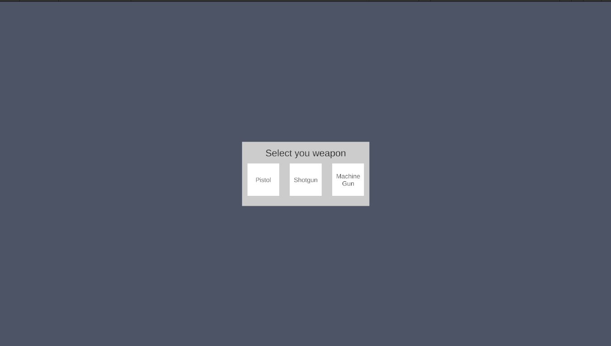

#### 기능
- 3종 무기 선택(Pistol, MachineGun, Shotgun)
- 무기별 고유 발사 패턴

<details>
<summary><b>📖 세부 설명 (클릭하여 펼치기)</b></summary>

#### 설계 의도

**목표**
- 무기 추가/변경 시 기존 코드 수정 최소화
- 데이터와 로직의 완전 분리

**의도**
- Shoot 클래스는 어떤 무기인지 알 필요 없이, "공격"만 전달
- 각 무기는 공통 로직은 재사용하며 고유 로직만 구현
- 밸런싱(데이터)과 구현(로직)을 분리

#### 구조도
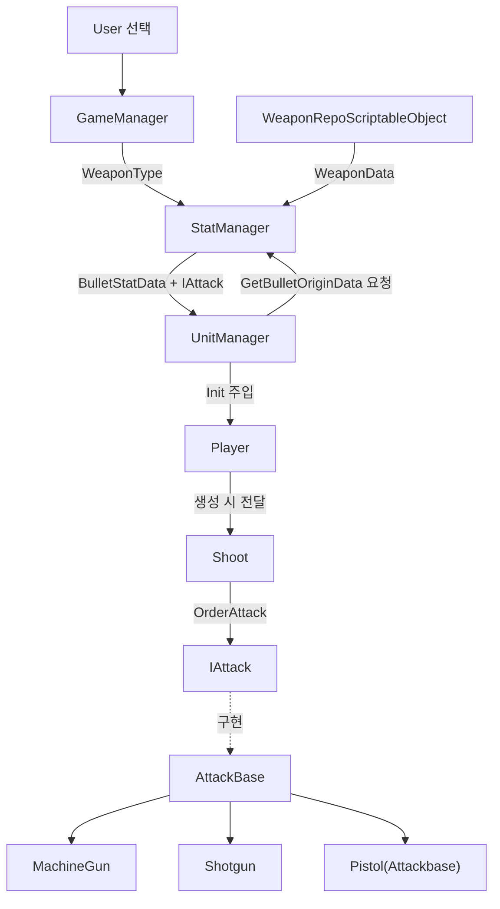

#### 핵심 구현

**1. Interface 기반 무기 추상화**
```csharp
public interface IAttack
{
    public void Init(BulletStatData data);
    public void OrderAttack(Vector2 position, Vector2 direction);
    public void Upgrade(BulletStatData data);
}
```
- 새로운 무기가 추가되어도 Shoot은 무기의 종류 상관없이 초기화, 공격, 업그레이드만 알게하기 위하여 Interface를 이용하여 구현

**2. 상속을 통한 공통 로직 재사용**

```csharp
// AttackBase.cs
public class AttackBase : IAttack
{
    protected BulletStatData curStatData;
    protected IPoolManager _poolManager;
    
    public void Init(BulletStatData data)
    {
        curStatData = data;
        _poolManager = PoolManager.instance;
    }
    
    protected virtual void Attack(Vector2 startPosition, Vector2 direction)
    {
        BulletMove bullet = _poolManager.GetBulletMove();
        bullet.Init(curStatData.BulletSpeed, direction, startPosition, 
                   curStatData.BulletDistance, _poolManager);
    }
}

// Shotgun.cs
public class Shotgun : AttackBase
{
    private float spread = 30f;
    
    protected override void Attack(Vector2 startPosition, Vector2 direction)
    {
        for (int i = 0; i < curStatData.BulletNum_PerShot; i++)
        {
            float randomAngle = Random.Range(-spread / 2f, spread / 2f);
            Vector2 randomDir = RotateVector(direction, randomAngle);
            // 총알 생성...
        }
    }
}
```
- 최소한의 구현으로 새로운 무기를 생성하기 용이하게 하기 위하여 상속

**3. 데이터와 로직의 분리**
```csharp
// WeaponData.cs
public class WeaponData
{
    public WeaponType WeaponType;      // 무기 타입
    public BulletConfig WeaponVal;     // 데이터 (ScriptableObject)
    public IAttack Weapon;             // 로직 (C# 클래스)
}

// WeaponRepo.cs
public WeaponData GetWeaponData(WeaponType weaponType)
{
    if (data.Weapon == null)
    {
        switch (data.WeaponType)
        {
            case WeaponType.Pistol:
                data.Weapon = new AttackBase();
                break;
            case WeaponType.MachineGun:
                data.Weapon = new MachineGun();
                break;
            case WeaponType.ShotGun:
                data.Weapon = new Shotgun();
                break;
        }
    }
    return data;
}
```

- 빠른 무기 밸런싱을 위한 데이터와 로직 분리

#### 클래스 코드 보기

| 클래스 | 역할 | 코드 |
|--------|------|------|
| **IAttack** | 무기 인터페이스 | [`보기`](Assets/Scripts/GamePlay/Attack/AttackBase/IAttack.cs) |
| **AttackBase** | 공통 로직 | [`보기`](Assets/Scripts/GamePlay/Attack/AttackBase/AttackBase.cs) |
| **MachineGun** | 연사 패턴 | [`보기`](Assets/Scripts/GamePlay/Attack/AttackBase/MachineGun.cs) |
| **Shotgun** | 산탄 패턴 | [`보기`](Assets/Scripts/GamePlay/Attack/AttackBase/Shotgun.cs) |
| **WeaponData** | 무기 데이터 | [`보기`](Assets/Scripts/Data/WeaponData/WeaponData.cs) |
| **WeaponRepo** | 무기 관리 | [`보기`](Assets/Scripts/Data/ScriptableObject_DB/WeaponRepo.cs) |
| **Shoot** | 발사 제어 | [`보기`](Assets/Scripts/GamePlay/Attack/Basic/Shoot.cs) |

</details>

---


### 3. 오브젝트 풀링

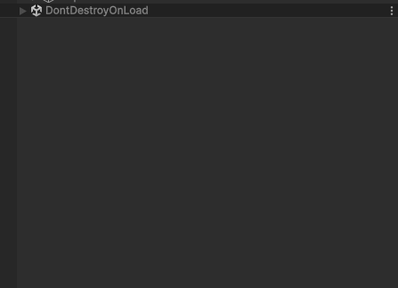

#### 기능
- 적, 총알 등과 같은 오브젝트 반환

<details>
<summary><b>📖 세부 설명 (클릭하여 펼치기)</b></summary>

#### 설계 의도

**목표**
- 어떤 오브젝트를 요청받던 넘겨줘야함
- 한 스크립트 안에서 해결
- Singleton을 사용하더라도 최대한 다른 스크립트들이 구조를 몰라야함

**의도**
- 제너릭 클래스를 이용하여 어떠한 종류의 오브젝트든 저장하도록 설계
- IPoolManager라는 interface를 만들고 이를 Singleton으로 만들어 최대한 분리

#### 구조도
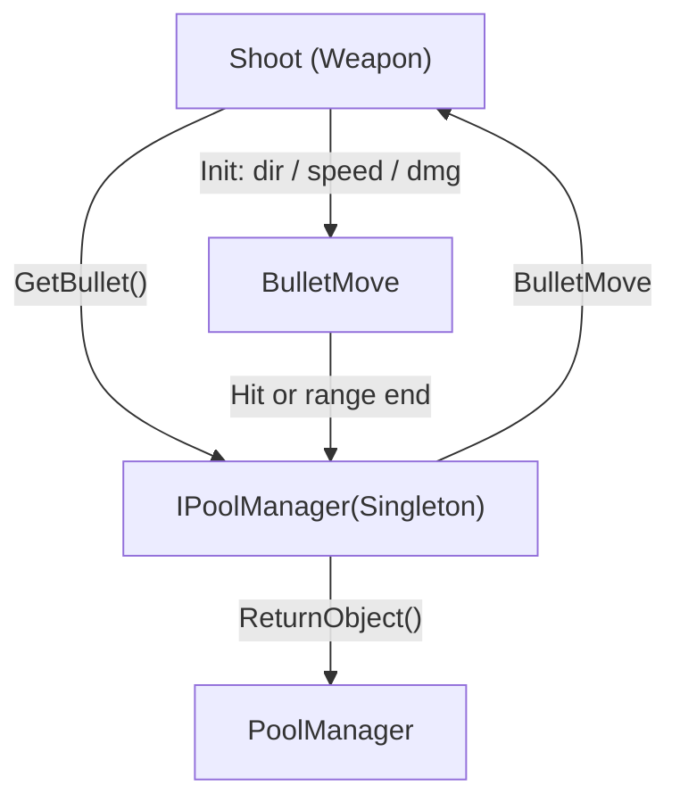

#### 핵심 구현

**1. 제네릭 클래스를 이용한 ObjectPool 구현**
```csharp
//PoolManager.cs
public class PoolManager : MonoBehaviour, IPoolManager
{
    ...
    //InGame
    private GameObjectPool<BulletMove> _bulletPool;
    ...
}

//GameObjectPool.cs
public class GameObjectPool<T> where T : MonoBehaviour
{
    private readonly T _prefab;
    private readonly IObjectPool<T> _pool;

    public GameObjectPool(T prefab, int defaultCapacity = 10, int maxSize = 100)
    {
        _prefab = prefab;
        _pool = new ObjectPool<T>(
            createFunc: Create,
            actionOnGet: OnGet,
            ...
        );
    }
    ...
}
```
- 제너릭 클래스를 만들어 PoolManager가 다른 여러개의 풀링을 관리할 수 있도록 설계

**2. Interface Singleton**
```csharp
//IPoolManager.cs
public interface IPoolManager
{
    public BulletMove GetBulletMove();
    public Enemy GetEnemy();
    public void ReturnBullet(BulletMove obj);
    public void ReturnEnemy(Enemy obj);
}

//PoolManager.cs
public class PoolManager : MonoBehaviour, IPoolManager
{
    public static IPoolManager instance;

    ...
}
```

- 전역 접근은 유지하되, 구현체(PoolManager)에 대한 직접 의존을 줄이기 위해 IPoolManager 인터페이스를 통해 접근하도록 구성

#### 클래스 코드 보기

| 클래스 | 역할 | 코드 |
|--------|------|------|
| **PoolManager** | 풀링 관리 | [`보기`](Assets/Scripts/Core/GameLoop/PoolManager.cs) |
| **IPoolManager** | 풀링 인터페이스 | [`보기`](Assets/Scripts/Core/GameLoop/Interface/IPoolManager.cs) |
| **Shoot** | 발사 제어 | [`보기`](Assets/Scripts/GamePlay/Attack/Basic/Shoot.cs) |
| **BulletMove** | 총알 오브젝트 | [`보기`](Assets/Scripts/GamePlay/Attack/BulletMove.cs) |

</details>

---

### 4. 적 스폰

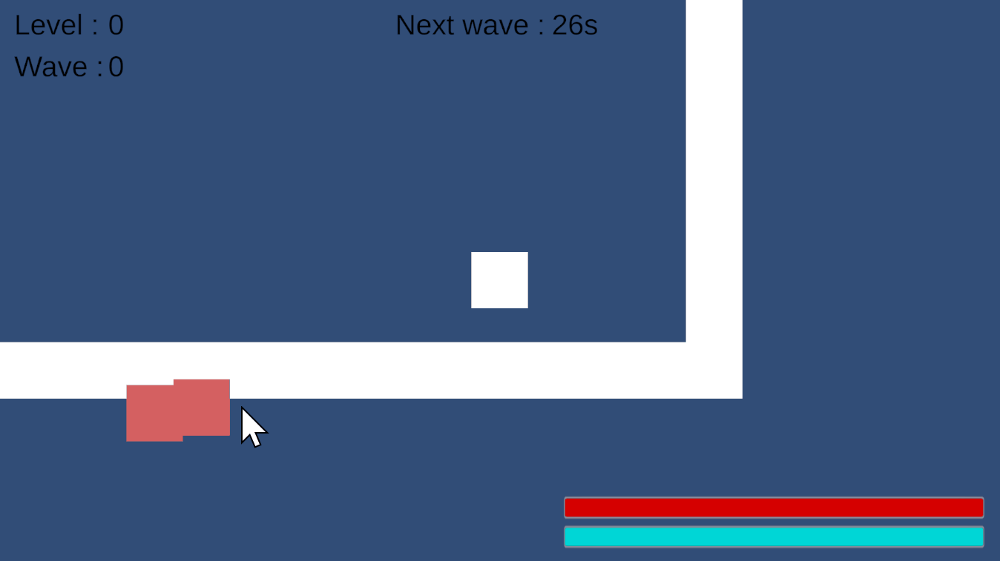

#### 기능
- 랜덤한 위치에서 적 스폰
- 플레이어 주변에서는 스폰 안함

<details>
<summary><b>📖 세부 설명 (클릭하여 펼치기)</b></summary>

#### 설계 의도

**목표**
- ScriptableObject로 넘겨받은 데이터를 토대로 스폰
- 플레이어의 주변에서는 스폰을 하면 안됨

**의도**
- 무기와 같이 Inspector에서 밸런싱이 가능해야 하기에 ScriptableObject 사용
- 현재 플레이어 위치를 토대로 계산하여 적 스폰 위치 계산
- Util형태로 namespace를 통해 어디서든 접근가능하게 설계

#### 구조도

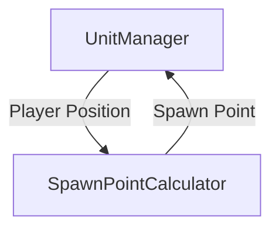

#### 핵심구현

**1. 스폰계산**
```csharp
//SpawnCalculator.cs
public static Vector2 GetRandomSpawnPosition(Vector2 minPoint, Vector2 maxPoint, Vector2 playerPosition, float minDistance)
{
    float maxDistance = GetMaxDistanceFromPlayer(
        playerPosition,
        minPoint,
        maxPoint
    );


    float randomDistance = Random.Range(minDistance, maxDistance);
    float randomAngle = Random.Range(0f, 360f);


    Vector2 direction = new Vector2(
        Mathf.Cos(randomAngle * Mathf.Deg2Rad),
        Mathf.Sin(randomAngle * Mathf.Deg2Rad)
    );

    Vector2 spawnPos = playerPosition + direction * randomDistance;


    spawnPos.x = Mathf.Clamp(spawnPos.x, minPoint.x, maxPoint.x);
    spawnPos.y = Mathf.Clamp(spawnPos.y, minPoint.y, maxPoint.y);

    return spawnPos;
}

private static float GetMaxDistanceFromPlayer(Vector2 playerPos, Vector2 minPoint, Vector2 maxPoint)
{
    Vector2[] corners = new Vector2[]
    {
        new Vector2(minPoint.x, minPoint.y),
        new Vector2(minPoint.x, maxPoint.y),
        new Vector2(maxPoint.x, minPoint.y),
        new Vector2(maxPoint.x, maxPoint.y)
    };

    float maxDistance = 0f;

    foreach (var corner in corners)
    {
        float distance = Vector2.Distance(playerPos, corner);
        if (distance > maxDistance)
        {
            maxDistance = distance;
        }
    }

    return maxDistance;
}
```

- 플레이어로부터 minDistance 이상 떨어진 곳에 스폰
- 각도 랜덤을 사용해 전 방향에서 스폰

#### 클래스 코드 보기

| 클래스 | 역할 | 코드 |
|--------|------|------|
| **UnitManager** | 유닛 관리 | [`보기`](Assets/Scripts/Core/GameLoop/UnitManager.cs) |
| **SpawnPointCalculator** | 스폰 위치 계산 | [`보기`](Assets/Scripts/Utils/SpawnPointCalculator.cs) |

</details>

---

### 5. 랜덤 스탯 업

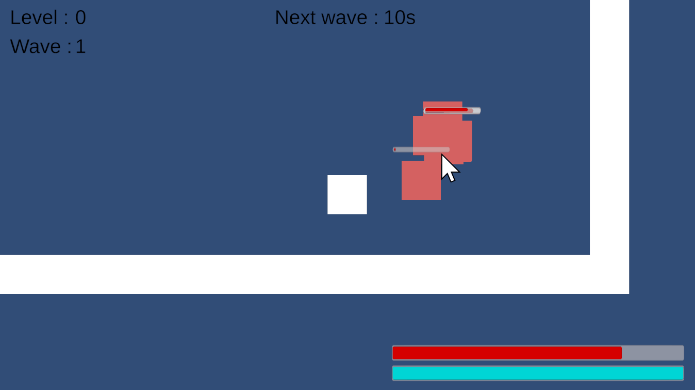

#### 기능
- 레벨업 시 랜덤한 3개의 스탯 선택지
- 사용하는 무기에 따라 특정 선택지 출현
- Plus/Percentage 두 가지 증가 방식

<details>
<summary><b>📖 세부 설명 (클릭하여 펼치기)</b></summary>

#### 설계 의도

**목표**
- ScriptableObject로 빠른 밸런싱
- 무기별 특화 업그레이드 제공
- 원본 스탯 기준 일관된 증가율 보장

**의도**
- Inspector에서 수치 조정만으로 밸런싱 완료
- 현재 사용 중인 무기와 관련된 업그레이드만 선택지에 포함

#### 구조도
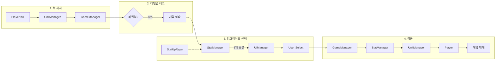

---

#### 핵심 구현

**1. ScriptableObject 기반 업그레이드 데이터**
```csharp
// StatUpRepo.cs
[Serializable]
public class WeaponStatUpData
{
    public WeaponStatType StatType;
    public List<WeaponType> ApplicableWeapons;
    
    public List<CalculateType> CalculateType;
    public float MinPlusVal;
    public float MaxPlusVal;
    public float MinPercentVal;
    public float MaxPercentVal;
    
    public string DisplayName;
}
```

- 코드 수정 없이 Inspector에서 밸런싱
- 무기별 업그레이드 필터링 (Pistol과 MachineGun은 총알 수 업그레이드 불가)
- Plus/Percentage 랜덤 선택으로 다양성 확보
<details>
<summary><b>📖 샘플 이미지 (클릭하여 펼치기)</b></summary>

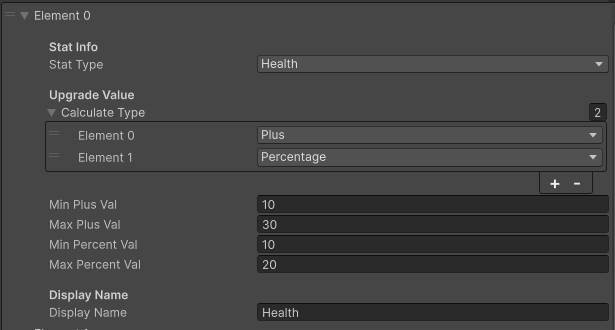

- StatType : 스탯 종류
- CalculateType : 등장 가능한 계산 방식

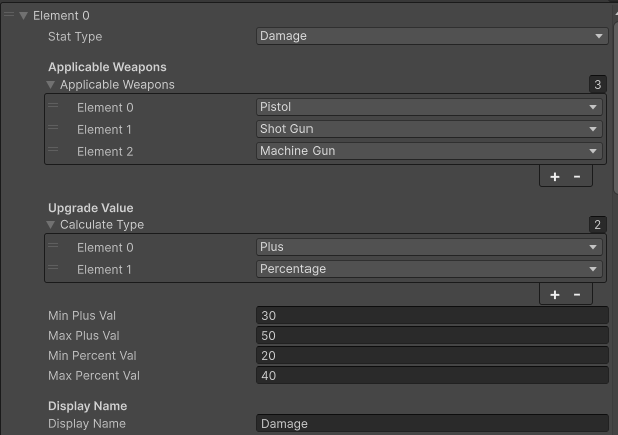

- StatType : 스탯 종류
- Applicable Weapons : 해당 스탯을 적용할 수 있는 무기
- CalculateType : 등장 가능한 계산 방식
</details>

---

**2. 무기별 필터링 + 랜덤 선택**
```csharp
// StatManager.cs
public List<UpgradeOption> ShuffleOptions(int count = 3)
{
    StatUpRepo statUpRepo = _dataManager.GetStatUpRepo();
    List<UpgradeOption> allOptions = new List<UpgradeOption>();
    
    foreach (var data in statUpRepo.PlayerStatUpData)
    {
        allOptions.Add(CreatePlayerOption(data));
    }
    
    foreach (var data in statUpRepo.WeaponStatUpData)
    {
        if (data.ApplicableWeapons.Contains(_curWeaponType))
        {
            allOptions.Add(CreateWeaponOption(data));
        }
    }
    
    return SelectRandomOptions(allOptions, count);
}
```

- 랜덤한 선택지가 나오도록 셔플
- Shotgun 사용 시 → Shotgun 관련 업그레이드 추가 표시
- 무의미한 선택지 제거(Pistol, MachineGun 사용 시)

---

**3. Plus/Percentage 랜덤 계산**
```csharp
private UpgradeOption CreateWeaponOption(WeaponStatUpData data)
{
    CalculateType randomCalType = data.CalculateType[
        Random.Range(0, data.CalculateType.Count)
    ];
    
    float randomVal = 0;
    if (randomCalType == CalculateType.Percentage)
        randomVal = Mathf.Round(Random.Range(data.MinPercentVal, data.MaxPercentVal));
    else
        randomVal = Random.Range(data.MinPlusVal, data.MaxPlusVal);
    
    return new UpgradeOption(
        UpgradeCategory.Weapon,
        (int)data.StatType,
        data.DisplayName,
        randomVal,
        randomCalType
    );
}
```

- 같은 스탯도 Plus/Percentage로 다르게 등장

---

**4. Fisher-Yates 셔플로 공정한 랜덤**
```csharp
private List<UpgradeOption> SelectRandomOptions(List<UpgradeOption> source, int count)
{
    if (count >= source.Count)
        return new List(source);
    
    List shuffled = new List(source);
    
    for (int i = shuffled.Count - 1; i > 0; i--)
    {
        int randomIndex = Random.Range(0, i + 1);
        
        UpgradeOption temp = shuffled[i];
        shuffled[i] = shuffled[randomIndex];
        shuffled[randomIndex] = temp;
    }
    
    return shuffled.GetRange(0, count);
}
```

- 모든 업그레이드가 동일한 확률로 선택
- Fisher-Yates를 이용하여 균등 분포 보장

#### 클래스 코드 보기

| 클래스 | 역할 | 코드 |
|--------|------|------|
| **StatManager** | 스탯 계산/업그레이드 | [`보기`](Assets/Scripts/Core/GameLoop/StatManager.cs) |
| **StatUpRepo** | 업그레이드 데이터 | [`보기`](Assets/Scripts/Data/ScriptableObject_DB/StatUpRepo.cs) |
| **UpgradeOption** | 업그레이드 옵션 구조체 | [`보기`](Assets/Scripts/Data/UpgradeOption.cs) |
| **GameManager** | 레벨업 처리 | [`보기`](Assets/Scripts/Core/GameLoop/GameManager.cs) |

</details>

---
